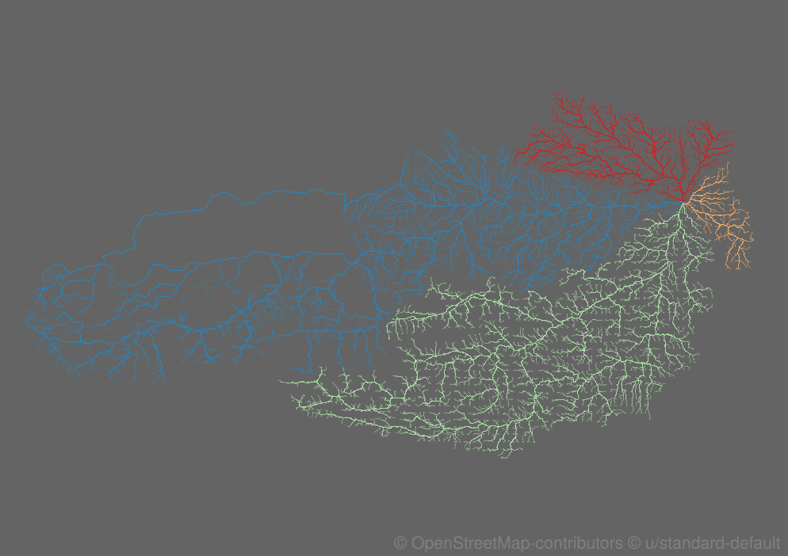

# AllRoadsLeadTo 
Combining routes that all lead to the same point and have their origins scattered evenly. For example within country borders



## Inspiration 
This project was inspired by [@ArterialMapping](https://twitter.com/ArterialMapping) who did a beautiful illustration called "The quickest route along primary roadways to Washington D.C. from any point in the United States". This is an attempt to achieve something similar using open source tools.

This project uses:
- [OSM data](https://download.geofabrik.de/)
- [osmconvert](https://wiki.openstreetmap.org/wiki/Osmconvert)
- [QGIS](https://www.qgis.org)
- [Graphhopper](https://github.com/graphhopper/graphhopper)
- [Python](https://www.python.org) & [pandas](https://pandas.pydata.org/) & [geopandas](https://geopandas.org/)
- [Inkscape](https://inkscape.org/)

***Installation and detailed description of QGIS, Inkscape, Python and pandas usage is not described here.***

This guide will describe the steps taken to achieve the rusult above. 


## Getting started

```
mkdir MyProject & cd MyProject
```

## Downloading and preparing the OSM data

For austria that's 623MB + some adjacent german states 278MB.

```
wget https://download.geofabrik.de/europe/austria-latest.osm.pbf & wget https://download.geofabrik.de/europe/germany/bayern/oberbayern-latest.osm.pbf & wget https://download.geofabrik.de/europe/germany/bayern/schwaben.html
```

To merge those .osm.pbfs you can use the osmconvert command-line tool which you can download [here](https://wiki.openstreetmap.org/wiki/Osmconvert). 


```
./osmconvert64 oberbayern-latest.osm.pbf --out-o5m | ./osmconvert64 - austria-latest.osm.pbf -o=austria-plus-deutsches-eck.pbf
./osmconvert64 schwaben-latest.osm.pbf --out-o5m | ./osmconvert64 - austria-plus-deutsches-eck.osm.pbf -o=austria-obayern-schwaben.osm.pbf
```

So you end up with one merged file `austria-obayern-schwaben.osm.pbf` which we will hand to the [GraphHopper routing engine](https://github.com/graphhopper/graphhopper).

## Creating a grid of points for the routing engine
With the help of the QGIS - Vector ► Research Tool: "regularpoints" we will create a csv file with a list of geographic coordinates that will serve as the starting points of our routes.

Use an appropriate polygon (for example the country borders) to define the extent for point - creation. A spacing of 0.05 degrees for "regularpoints" led in this case to 4000 points after clipping. Use the same polygon to clip the point layer. 
Then save the point - layer in csv format and explicitely include the geometry `GEOMETRY = AS_XY`. The route-creation script expects the csv to only have the fields "fid", "x" and "y".

<!-- There is a file accompanying the austrian OSM data describing its boundaries. `https://download.geofabrik.de/europe/austria.poly`, but unfortunately we wont be able to use it without additional python packages and conversion.
To first define the extent of the area we are interested in we download the "Admin 0 - Countries" data from [naturalearthdata.com](https://www.naturalearthdata.com/downloads/10m-cultural-vectors/10m-admin-0-countries/)

```
wget https://www.naturalearthdata.com/http//www.naturalearthdata.com/download/10m/cultural/ne_10m_admin_0_countries.zip
```
 -->
 
## Getting the routing engine running

Download the engine and a config file
```
wget https://graphhopper.com/public/releases/graphhopper-web-3.0.jar https://raw.githubusercontent.com/graphhopper/graphhopper/3.x/config-example.yml
```
For this purpose I did not change the default config given by the `config-example.yml`. It's set up for a "car / fastest" routing profile.

Start the engine. The first time it will take a while for it to process the input data. Because it's quite a lot of input data, the maximum available memory size is adjusted with `-Xmx2G`.
```
java -Ddw.graphhopper.datareader.file=austria-obayern-schwaben.osm.pbf -Xmx2G -jar *.jar server config-example.yml
```

We now have a running routing engine that expects our queries. We create a directory that will hold our resulting gpx files.

```
mkdir gpx_files
```

## Querying the routes

With the help of a python script `routecreator.py` we query a route from all the points in our csv file to a central point defined in the script.

```
python routecreator.py
```

In this case there were xxx980xxx routes created which took about 10min.
Another script will combine all those routes into one GeoPackage file.

```
python merger.py
```

***Following steps include:***

 - changing Layer Style options to enlargen overlapping features
 - drawing polygons manually
 - exporting PDFs of route network and sectioning polygons
 - using the route layer as a mask combine the two pdf in Inkscape

